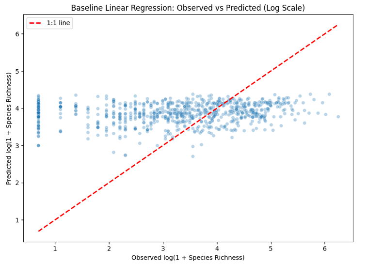
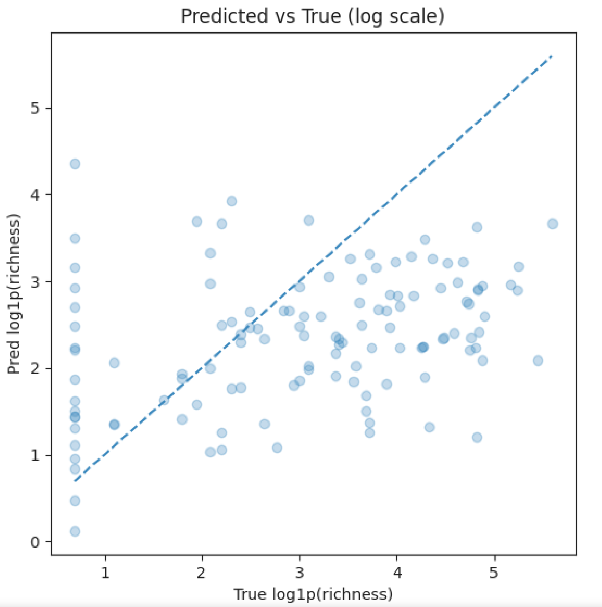
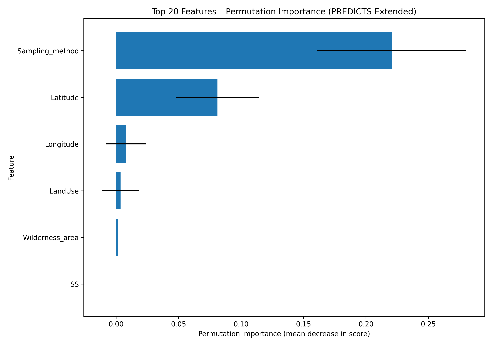

<!-- _class: invert -->
<!-- _backgroundColor: #46afa0 -->
<!-- _paginate: skip -->

# MM-BioGraph: Multimodal Data Analysis for Link Prediction in Biodiversity Graphs

---

# Agenda

- Problem definition
- Data and baseline task (tabular PREDICTS)
- Baseline models (tabular) + WandB results
- Feature importance (RF permutation)
- Next steps (time window, LSTM / temporal baseline)

---

# Problem definition

## Goal (PREDICTS baseline → thesis direction)

Given site-level covariates from PREDICTS, predict a biodiversity target.

- **Input**: site-level features $x_i$ (land use, biome, location, sampling method, etc.)
- **Target (baseline)**: site-level species richness $y_i$ (trained on $y_i=\log(1+\text{richness}_i)$)

$$
\hat{y}_i = f_\theta(x_i)
$$

**Why this baseline:** establish what signal exists in tabular site-level predictors before moving to  
time-window prediction and graph-based models.

---

# Dataset & baseline tasks

**Dataset:** PREDICTS site-level table (`predicts_extended`)

**Target:**
$$
y_i = \log(1 + \text{SpeciesRichness}_i)
$$

**Features:**
- numeric: e.g. latitude / longitude (small $p$)
- categorical: land use, biome, realm, habitat, etc. (large $q$ after one-hot)

**Model + evaluation:**
- MLP regression on $x_i \in \mathbb{R}^{p+q}$
- train/val/test split
- metrics: MSE / RMSE (on log scale) + prediction diagnostics (pred vs true, residuals)

---

# Results,  Linear Regression, MLP

 

---

# Feature importance (PREDICTS tabular baseline)

**Top drivers (PREDICTS extended, site-level):**
- **Sampling_method** dominates - strong measurement / protocol effect
- **Latitude** next - broad geographic/biome gradient signal
- **Longitude / LandUse** small contributions in this baseline

**Interpretation:** model signal is heavily shaped by sampling protocol + location, suggesting limited predictive power from site covariates alone.

---
# Feature importance data visualisation

---

# Time-based problem (intuition)

- Today: predict biodiversity from a *single* site snapshot (tabular)
- Next: predict biodiversity using **how the site changes over time**
- Idea: use a **past window** of observations to predict a **future window** target

**Example**
- Input: last 3–5 years of (land use, sampling, species observations)
- Output: next-year biodiversity (e.g., richness / abundance / BII)

---

# Time-based problem

$$\text{TimeBasedPrediction}(\mathbf{X}_{pw}) = \mathbf{Y}_{fw}$$

- $pw$: past window, $fw$: future window
- $\mathbf{X}_{pw}$: sequence of observations in $pw$, e.g. $\{(S_t, L_t, B_t)\}_{t\in pw}$ (species, land-use, biome, etc.)
- $\mathbf{Y}_{fw}$: biodiversity target in $fw$ (e.g. richness / abundance / BII)
- Implementation plan: create sliding windows (e.g. `load_df_wins`), encode each time step, train an LSTM to map $\mathbf{X}_{pw}\rightarrow \mathbf{Y}_{fw}$, log runs/metrics to W\&B

---

# Next steps

- **Dec:** dataset exploration + feature importance  
- **Jan:** more tabular experiments + start MC1 write-up  
- **Feb:** finish report + presentation prep - **MC1 (week of Feb 9)**

