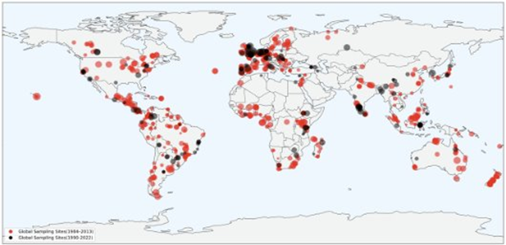
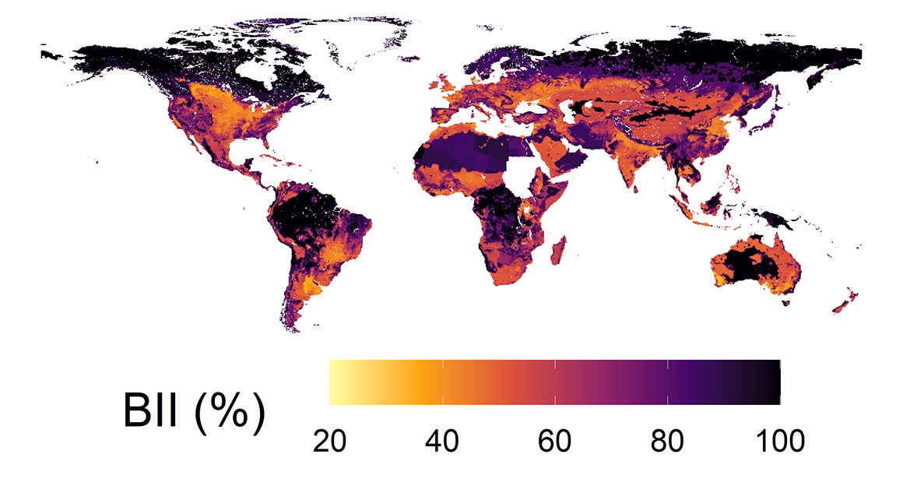
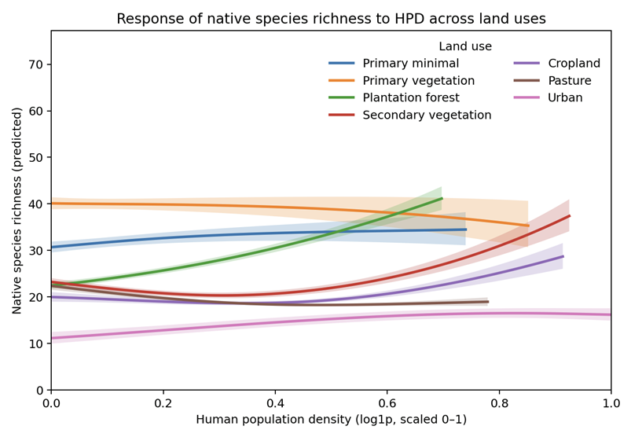
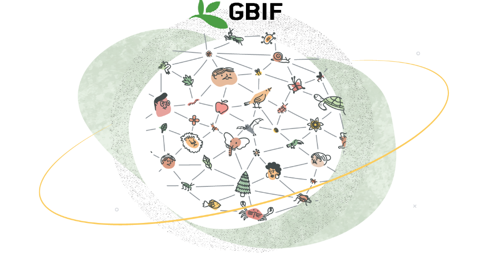
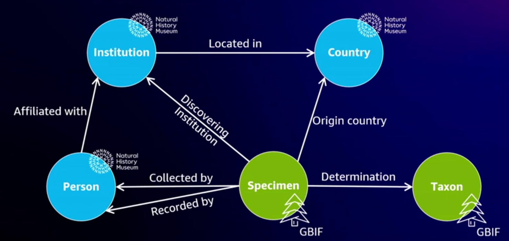

<!-- _class: invert -->
<!-- _backgroundColor: #46afa0 -->
<!-- _paginate: skip -->

# BioGraphs: Biodiversity Intactness Prediction Leveraging Graphs

## Alan Guedes - `a.guedes@reading.ac.uk`

---

# Who I am?

- <u>Recently hired</u> as UoR **Computer Science Lecturer**
- My research interest lies in **Computer Vision**, and **Generative AI**
- I enjoy interdisciplinary (e.g. Humanities, Ecologists)
- National History Museum (NHM) has a ongoing partinership with University of Reading (UoR) given part of NHM moving to near Reading

---

# Context  

- Climate crisis is accelerating biodiversity loss.  
- Growing availability of biodiversity data (texts, images, environmental reports) → often siloed.  
- **Biodiversity Intactness Index (BII):** measures ecosystem health by comparing species abundance to undisturbed baselines.  

---

# NHM PREDICTS Dataset

- **PREDICTS = Projecting Responses of Ecological Diversity In Changing Terrestrial Systems**.  
- Global dataset covering >3.2 million records of species abundance and occurrence.  
- Captures land-use change, human pressures, and ecological responses.  
- Foundation for BII predictions

---

# NHM PREDICTS Dataset

---

# NHM BII using PREDICTS

- **Biodiversity Intactness Index (BII):** measures ecosystem health by comparing species abundance to undisturbed baselines.  

 

---

# BII using PREDICTS

 
 

$\mathcal{O}_x  \vdash \mathcal{BII}_x$

- $x$: region
- $\mathcal{O}_x$: observation over a region (i.e, biome, spaces, land usage)
- $\mathcal{BII}_x$ over the biome (i.e, a value)

---

# Examples of Invasive Species  

- Invasive species are a major driver of biodiversity change
  - **Grey squirrel (UK):** outcompetes native red squirrels, altering woodland dynamics.  
  - **Cane toad (Australia):** toxic to native predators, disrupts food webs.  
  - **Black rat (islands worldwide):** decimates seabird populations by predation on eggs.  
  - **Plant invasions (e.g., *Lantana camara*):** modify habitats, reducing native plant diversity.  

- PREDICTS data is not aware of such relationhips (**or knowledge**).

---

# Research Question  

## *How can we improve current statistical BII prediction methods by integrating Knowledge-based ML approaches?*

---

# BII using PREDICTS and knowledge

 
 

$\mathcal{O}_x \textcolor{red}{\cup \mathcal{K}}  \vdash \mathcal{BII}_x$

- $x$: region
- $\mathcal{O}_x$: observation over a region (i.e, biome, spaces, land usage)
- $\mathcal{BII}_x$ over the biome (i.e, a value)
- $K$ knowledge over the species relationship

---

# GBIF—the Global Biodiversity Information Facility—

is an international network and data infrastructure

- **knowledge graph of species, habitats, and environmental variables**.  
- Links biodiversity records into interconnected structures.  

---

# NHM Planetary Knowledge Base (PKB)

- NHM Planetary Knowledge Base uses GBIF organise their dataset collections

---

# Methodology twofold

**Neuro-symbolic ML**  

- Combine statistical learning with symbolic reasoning.  
- Enhance explainability of biodiversity predictions.  
- Useful for conservation policies needing transparent evidence.  

**Graph-based ML**  

- Graph Neural Networks (GNNs).
- Learn species interactions and ecosystem dependencies.  
- Predict unobserved links and ecosystem changes.  

---

# Final Remarks  

- Climate crisis makes biodiversity prediction urgent.  
- BioGraphs integrates **Knowledge** in BII prediction.  
- Expected outcomes:  
  - More accurate BII predictions.  
  - Insights into hidden ecological connections.  

---

# References  

- Hudson et al. (2016) *The database of the PREDICTS project* – Ecology and Evolution.  https://onlinelibrary.wiley.com/doi/full/10.1002/ece3.2579
- NHM Biodiversity Intactness Index: https://www.nhm.ac.uk/our-science/services/data/biodiversity-intactness-index.html  
- NHM Planetary Knowledge Base videos
  - https://www.youtube.com/watch?v=3CcSRygfVgk  
  - https://biss.pensoft.net/article/111168/

---

<!-- _class: invert -->
<!-- _backgroundColor: #46afa0 -->
<!-- _paginate: skip -->

# Thank you

Alan Guedes, `a.guedes@reading.ac.uk`
