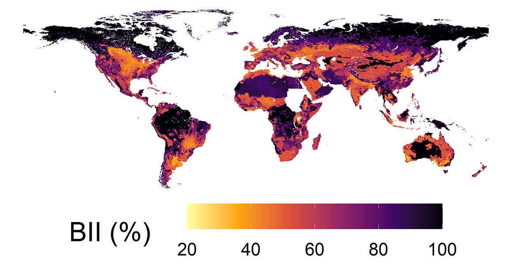
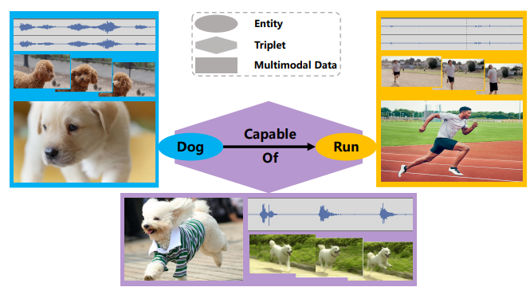
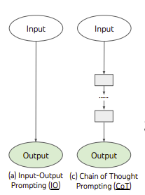

# MM-BioGraph: Multimodal Data Analysis for Link Prediction in Biodiversity Graphs

 

## Context

- **Biodiversity Intactness Index (BII):** Quantifies the impact of human activities on biodiversity by assessing changes in species abundance across various biomes (PREDICTS dataset).
- **Problem:** Valuable multimodal biodiversity data (text reports, images) are often siloed, hindering comprehensive understanding of relationships.
  - Can land-use data and images reveal environmental impacts on BII and species changes?
- There is a partnership with a Researcher from National History Museum (NHM) Future Lab, who created the PREDICTS Dataset

  

## Methodology

The project aims to integrate diverse data into graph-based structures to represent biodiversity relationships and predict unobserved links.

1. **BII Multimodal Dataset Generation**: Collaborate with NHM specialists to develop a comprehensive multimodal dataset (textual, visual, ecological) to support robust graph representation.
2. **GNN Baseline Development**: Establish a **Graph Neural Network (GNN) baseline model** for initial analysis of biodiversity relationships using the generated dataset.
3. **LLM-Assisted GNN**: Build upon the GNN baseline by applying **Large Language Models (LLMs)** alongside visual data. This approach will iteratively refine predictions and achieve more accurate and comprehensive insights into complex biodiversity relationships. It can also leveraging **Chains of Thought (CoT)** reasoning.

---

## References

- https://www.nhm.ac.uk/our-science/services/data/biodiversity-intactness-index.html
- https://onlinelibrary.wiley.com/doi/full/10.1002/ece3.2579
- https://dl.acm.org/doi/abs/10.1145/3581783.3612266
- https://arxiv.org/abs/2403.07311

Datasets:

- https://data.nhm.ac.uk/dataset/release-of-data-added-to-the-predicts-database-november-2022
- https://data.nhm.ac.uk/dataset/the-2016-release-of-the-predicts-database
- https://data.nhm.ac.uk/dataset/bii-developed-by-nhm-v2-1-1-limited-release
